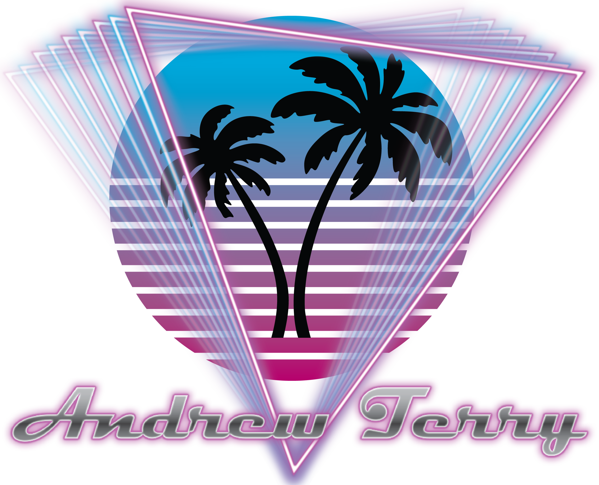

👋 Hi, I’m Andrew Terry

I'm a big nerd and love anything tech. I am especially passionate about FPV drones, R/C cars and planes, electronics, and robotics. I'm currently studying computing at Queen's University.

I am currently working on using a raspberry pi with a 4g cellular HAT and a camera to control an R/C car and make rover that can go anywhere with a cell signal.

If you want to reach out, you can connect with me at:

<!---
MangoTheBirb/MangoTheBirb is a ✨ special ✨ repository because its `README.md` (this file) appears on your GitHub profile.
You can click the Preview link to take a look at your changes.
--->
